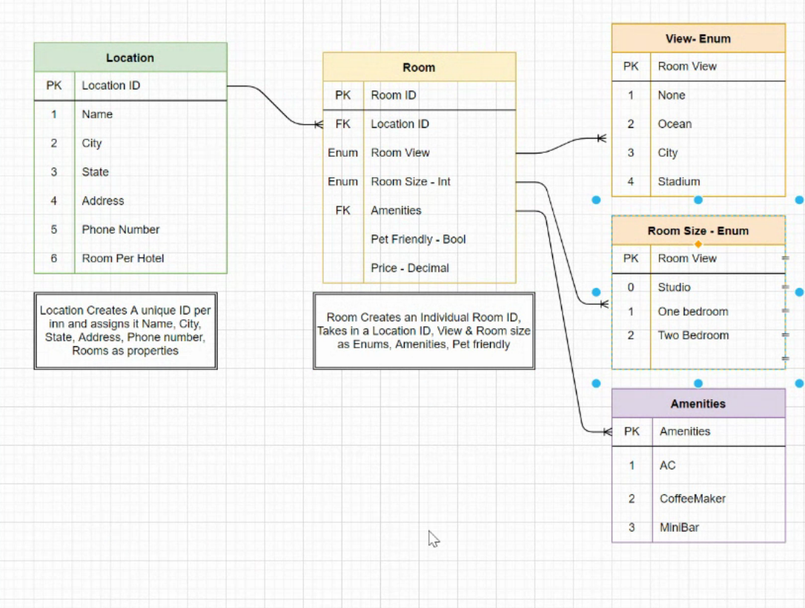

# Async-Inn

# Diagram Lab 11 - Async Inn 

## Worked with

Created with miriam silva .

## Description

This is the diagram related to lab 11 and will be used during the week as a template for the programming. The Location table allows us to create a lab and properties for the location. The location id is then passed to the Room table and used to create a unique room. The unique room is then made with certain properties such as the ammenities or room number, size and even if it is pet friendly.